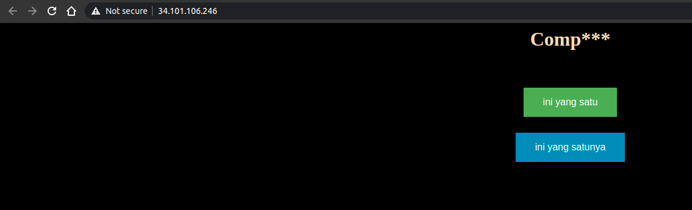
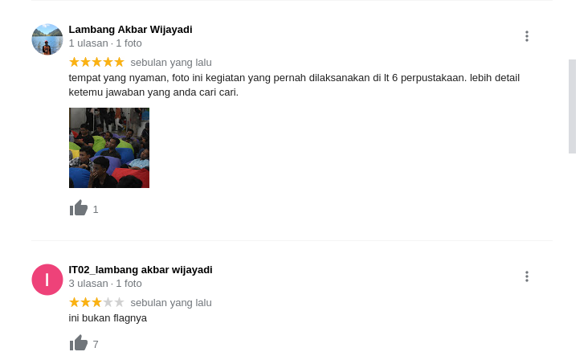
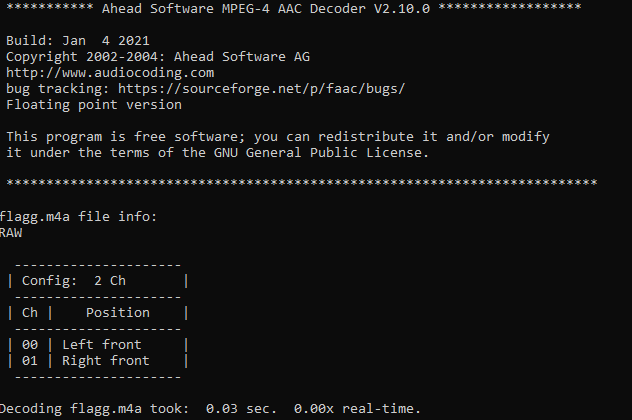
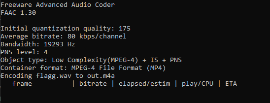
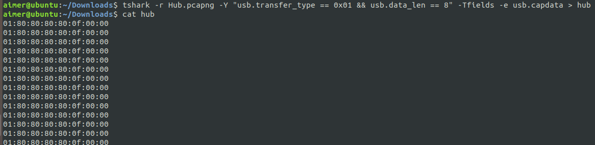
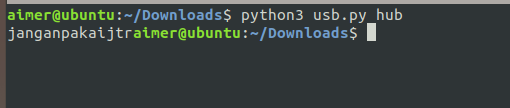
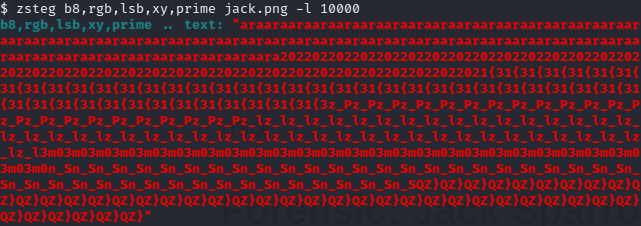

# ARA CTF 2021 - Cynuskinesis

### Miscellaneous: We Promise No Shit!
Diberi challenge untuk mencari url web dari gabungan url shortener milik alumni ITS dan judul lagu diva indonesia. Setelah mencari didapatkan link https://intip.in/hatiyangkausakiti/ yang langsung redirect ke web yang berisi compare text.



Terdapat 2 link yang berisi tulisan yang mirip, tapi setelah dicompare terdapat perbedaan dan didapatkan kalimat **HMIT adalah himpunan mahasiswa teknologi informasi, lokasi hmit?
perpustakaan its, coba cari di maps**. Lalu cari perpustakaan ITS dan cek bagian ulasan terdapat video yang berisi flag.



**Flag: ara2021{oP3n_0N_Mo131L3}**

### Forensic: The Lady Sound
Diberi file audio flag.m4a yang rusak. Kami mencoba mencari cara untuk memperbaikinya, ditemukan caranya dengan menggunakan **faad** dan **faac**. Caranya hapus hex bagian t sampai mdat, lalu gunakan faad untuk decode dan menghasilkan file flag.wav



Kemudian encode dengan faac dan hasilnya file m4a baru. 



Buka dan terdengar suara wanita menyebutkan flag.
**Flag: ara2021{th15_15_34sy}**

### Forensic: Hub
Diberi file packet Hub.pcapng yang berisi protokol USB dan Leftover Capture Data yang merupakan input atau klik dari keyboard. Ggunakan tshark untuk mengambil data dengan filter **usb.transfer_type** dan **usb.data_len**.



Dari data yang didapat, buat script python untuk mendekripsinya.
```python
import sys

KEY_CODES = {
    0x04:['a', 'A'],
    0x05:['b', 'B'],
    0x06:['c', 'C'],
    0x07:['d', 'D'],
    0x08:['e', 'E'],
    0x09:['f', 'F'],
    0x0A:['g', 'G'],
    0x0B:['h', 'H'],
    0x0C:['i', 'I'],
    0x0D:['j', 'J'],
    0x0E:['k', 'K'],
    0x0F:['l', 'L'],
    0x10:['m', 'M'],
    0x11:['n', 'N'],
    0x12:['o', 'O'],
    0x13:['p', 'P'],
    0x14:['q', 'Q'],
    0x15:['r', 'R'],
    0x16:['s', 'S'],
    0x17:['t', 'T'],
    0x18:['u', 'U'],
    0x19:['v', 'V'],
    0x1A:['w', 'W'],
    0x1B:['x', 'X'],
    0x1C:['y', 'Y'],
    0x1D:['z', 'Z'],
    0x1E:['1', '!'],
    0x1F:['2', '@'],
    0x20:['3', '#'],
    0x21:['4', '$'],
    0x22:['5', '%'],
    0x23:['6', '^'],
    0x24:['7', '&'],
    0x25:['8', '*'],
    0x26:['9', '('],
    0x27:['0', ')'],
    0x28:['\n','\n'],
    0x29:['[ESC]','[ESC]'],
    0x2a:['[BACKSPACE]', '[BACKSPACE]'],
    0x2C:[' ', ' '],
    0x2D:['-', '_'],
    0x2E:['=', '+'],
    0x2F:['[', '{'],
    0x30:[']', '}'],
    0x32:['#','~'],
    0x33:[';', ':'],
    0x34:['\'', '"'],
    0x36:[',', '<'],
    0x37:['.', '>'],
    0x38:['/', '?'],
    0x39:['[CAPSLOCK]','[CAPSLOCK]'],
    0x2b:['\t','\t'],
    0x4f:[u'→',u'→'],
    0x50:[u'←',u'←'],
    0x52:[u'↑',u'↑'],
    0x51:[u'↓',u'↓']
}

def read_use(file):
    with open(file, 'r') as f:
        datas = f.read().split('\n')
    datas = [d.strip() for d in datas if d] 
    cursor_x = 0
    cursor_y = 0
    offset_current_line = 0
    lines = []
    output = ''
    skip_next = False
    lines.append("")
    
    for data in datas:
        shift = int(data.split(':')[0], 16)
        key = int(data.split(':')[2], 16)

        if skip_next:
            skip_next = False
            continue
        
        if key == 0 or int(data.split(':')[3], 16) > 0:
            continue
        
        if shift != 0:
            shift=1
            skip_next = True

        if KEY_CODES[key][shift] == u'↑':
            lines[cursor_y] += output
            output = ''
            cursor_y -= 1
        elif KEY_CODES[key][shift] == u'↓':
            lines[cursor_y] += output
            output = ''
            cursor_y += 1
        elif KEY_CODES[key][shift] == u'→':
            cursor_x += 1
        elif KEY_CODES[key][shift] == u'←':
            cursor_x -= 1
        elif KEY_CODES[key][shift] == '\n':
            lines.append("")
            lines[cursor_y] += output
            cursor_x = 0
            cursor_y += 1
            output = ''
        elif KEY_CODES[key][shift] == '[BACKSPACE]':
            output = output[:-1]
            cursor_x -= 1
        else:
            output += KEY_CODES[key][shift]
            cursor_x += 1

    if lines == [""]:
        lines[0] = output

    return '\n'.join(lines)

if __name__ == '__main__':
    if len(sys.argv) < 2:
        print('Missing file to read...')
        exit(-1)
    sys.stdout.write(read_use(sys.argv[1]))
```
Jalankan hasilnya



Ketika kami submit ternyata salah, kami cek kembali file packet ternyata terdapat file zip di dalamnya. Ekstrak menggunakan foremost dan ketika membuka file didalamnya diminta password, kami coba menggunakan string yang didapat tadi dan didapatkan flag.

**Flag: ara2021{password_zip_alay_tapi_flag_jangan_alay}**

### Forensic: Jack Sparrow
Diberi file jack.png yang hanya berisi warna. Solvenya bisa dengan mencari nilai hex dari warna tersebut dan decode, tapi kami coba pakai zsteg dengan command **zsteg b8, rgb, lsb, xy, prime jack.png -l 10000**.



Hasilnya flag yang terduplikat charnya.
**Flag: ara2021{3z_Pz_l3m0n_SQZ}**