# Arkavidia 7.0 CTF - heker masa depan 😎


## Qualification

### Miscellaneous: Welcome to Arkavidia 7.0
Join ke discord CTF Arkavidia 7 dan flag ditemukan di channel misc.

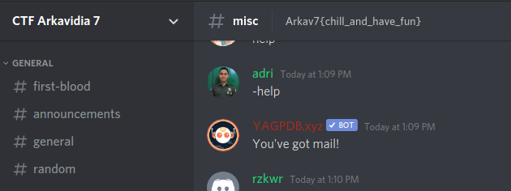

**Flag: Arkav7{chill_and_have_fun}**

### Miscellaneous: Sad and Lonely Friend
Di dalam discord terdapat bot dengan nama dalam bentuk kanji yang artinya Sad and lonely bot, chat bot tersebut untuk menjadi temannya dan chat command **help** akan diberi beberapa pilihan.

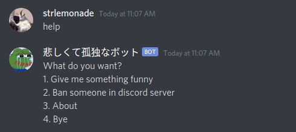

Di pilihan about akan diberi link repo github bot tersebut, analisa source code dari bot tersebut dan terdapat command **i need a flag** yang ternyata tidak menampilkan flag. Jadi kami melihat commit yang dilakukan, ternyata terdapat perubahan command yang sebelumnya **wish me luck** diubah menjadi **i need a flag**, 

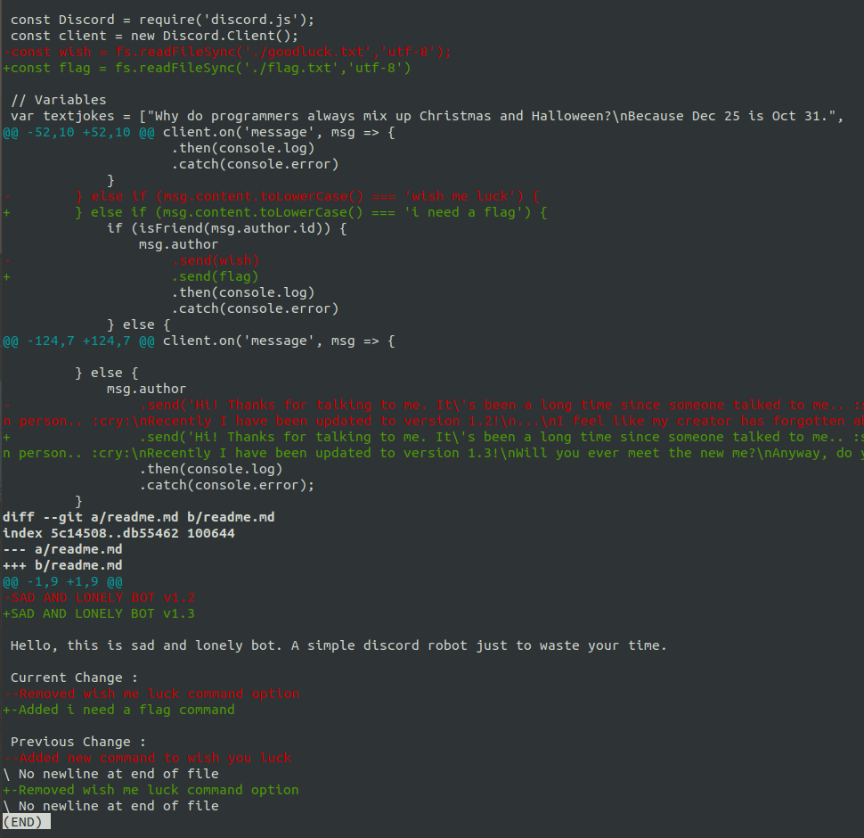

Saat dicoba command **wish me luck** didapatkan flag

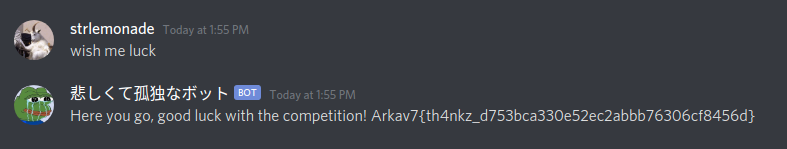

**Flag: Arkav7{th4nkz_d753bca330e52ec2abbb76306cf8456d}**

### Miscellaneous: isekai
Diberikan file isekai.zip yang berisi file main dan manual.txt yang merupakan game, kami mencoba command strings pada file main dan didapatkan flag.

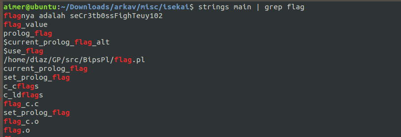

**Arkav7{seCr3tb0ssFighTeuy102}**

### Miscellaneous: OSINT-1
Di challenge ini, kita harus mencari tempat yang disinggahi seseorang dan nama tempat tersebut merupakan flag. Di deskripsi diberi kita harus mencari sebuah penulis jurnal pada **Springer**, kami cari dan mendapatkan jurnal berjudul **Rucio: Scientific Data Management** dengan banyak sekali penulis, namun kami tertuju pada sebuah nama dengan icon email yaitu **Mario Lassnig**.


Kami kemudian melakukan pencarian mengenai orang tersebut dan didapat twitter **@mlassnig**, di deskripsi soal disebutkan tanggal 1 Nov 2019, saat dicek tweetnya didapatkan.

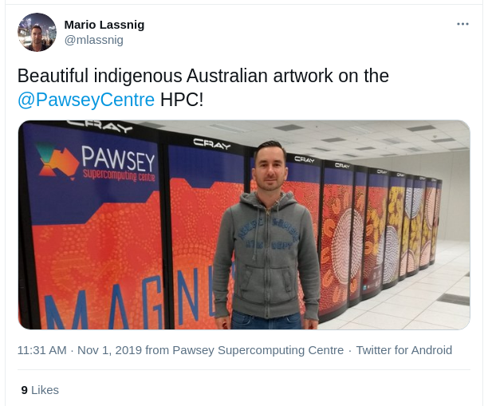

**Flag: Arkav7{pawsey_supercomputing_centre}**

### Forensics: KawaiiMetal
Di challenge ini diberi file chall.zip yang berisi 4 foto dengan nama babymetal dan 3 anggotanya. Analisa 4 file tersebut seperti berikut.
* Terdapat file zip didalam file Babymetal.jpg yang bisa diekstrak menggunakan foremost.
* Strings file Moa-metal.png terdapat string hint **Every hidden messages you see are encoded with base64**
* Strings file Yui-metal.jpg terdapat string hint **Strings and grep with the regex "=$" is beextremely
useful**
* Dengan hint dari Yui-metal.jpg, dari file terakhir Su-metal.jpg didapatkan string base64 didecode hasilnya seperti berikut

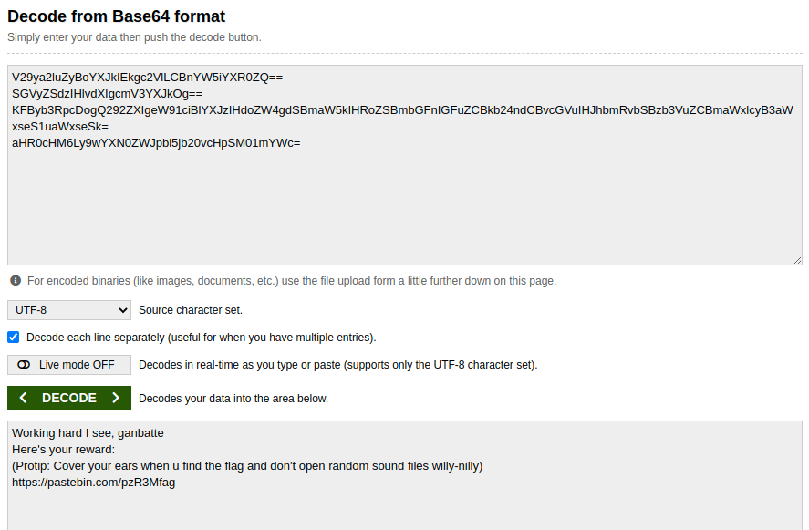

Link pastebin tersebut berisi password dari file zip yang didapatkan dari Babymetal.jpg. Setelah diekstrak didapatkan file flag.flac yang merupakan SSTV (Slow-scan television), file tersebut bisa didecode menggunakan QSSTV dan menghasilkan flag.

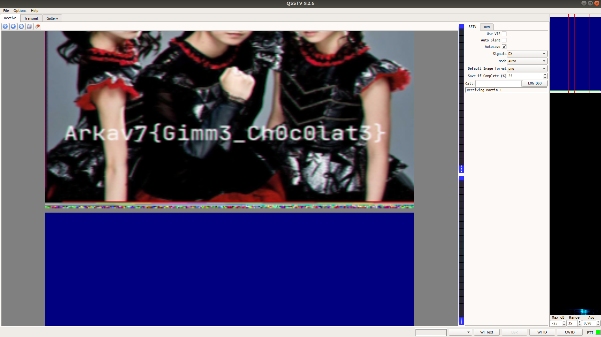

**Flag: Arkav7{Gimm3_Ch0c0lat3}**

### Forensics: It's me
Diberi file itsme.jpg ketika dicek menggunakan exiftool tidak mendapatkan apapun. Kami mencoba menggunakan stegsolve terlihat url pada efek Green plane 1

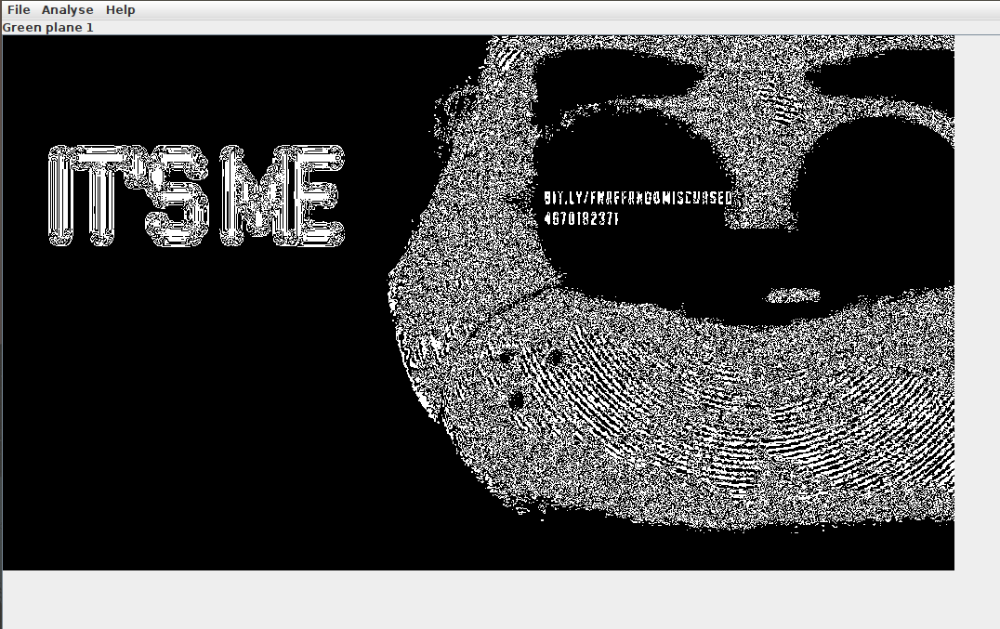

Url tersebut mengarah ke google drive yang berisi file .bash_history, itsme.zip, dan pass,txt. Analisa terhadap .bash_history, file itsme.zip telah dizip dengan password yang ada di pass.txt namun dengan 2 char terakhir dihapus, kami lalu membuat script bruteforce menggunakan python.
```python
import string, zipfile

file_zip = zipfile.ZipFile("itsme.zip")

for char in string.printable:
	for char2 in string.printable:
		password = "z198742069ba1230madjywl210472nadwm19iz" + char + char2
		try:
			file_zip.extractall(pwd = password)
			password = "Password found: {}".format(password)
			print(password)
			break
		except:
			pass
```
Jalankan

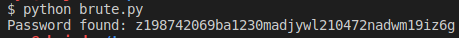

Ekstrak file zip dan didapatkan file wav yang isinya morsecode, digunakan decoder online hasilnya seperti berikut.

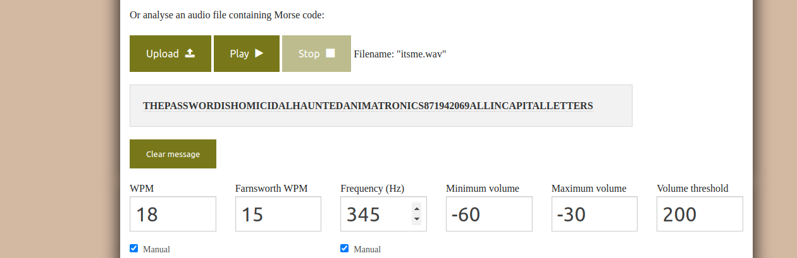

Kami mengira itu merupakan flag, ternyata file terdapat file didalam itsme.jpg yang bisa diekstrak menggunakan steghide dengan password morsecode tadi, didapatkan file txt berisi flag.

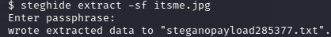

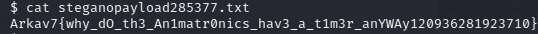

**Flag:
Arkav7{why_dO_th3_An1matr0nics_hav3_a_t1m3r_anYWAy1209362819
23710}**