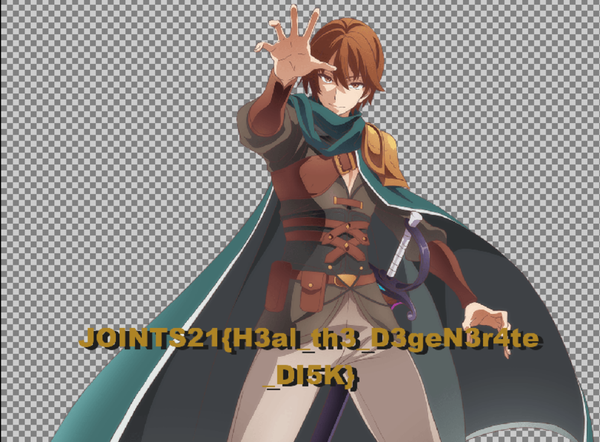
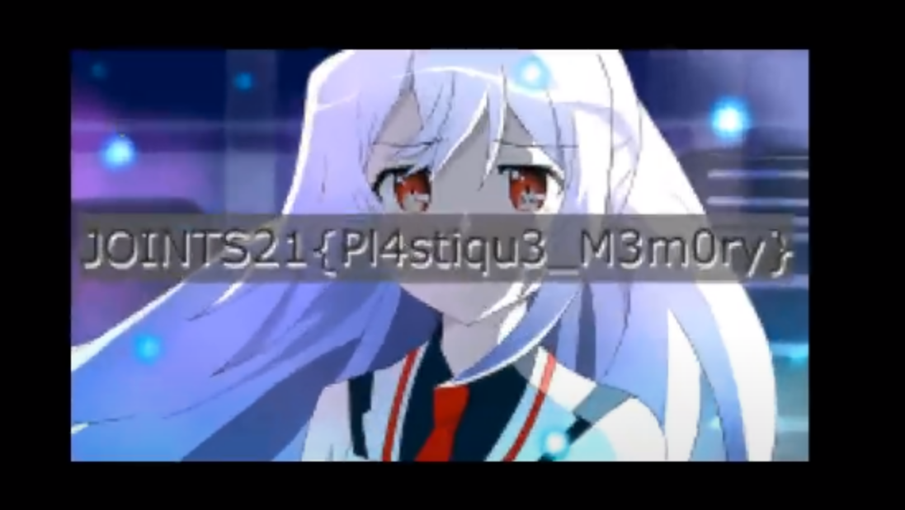
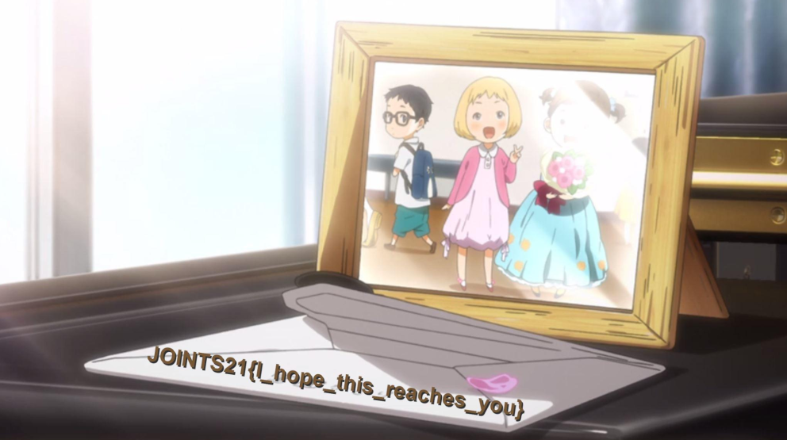

  
# JOINTS2021 CTF - jeopardized

## Kualifikasi

### Forensics: Where is the file
Diberi file zip berisi 4 image file, dilihat menggunakan binwalk disk1.img dan disk3.img terdapat file png. File png disk3,img berisi qrcode yang ketika discan mengarah ke rickroll, sementara file png disk1.img rusak, kami memperbaikinya menggunakan [PCRT](https://github.com/sherlly/PCRT)

**Flag: JOINTS21{H3al_th3_D3geN3r4te_DI5K}**

### Forensics: My memories with my waifu
Diberi file zip berisi memory dump, mencoba strings dengan filter flag terlihat jika probset mengakses file pada direktori C:\Users\Forensic\flag.png. Dari sana kami coba dump proses Explorer.exe, file dump lalu di ekstrak menggunakan foremost, hasilnya

**Flag: JOINTS{Pl4stiqu3_M3m0ry}**

### Forensics: Watashi no uso
Diberi file .wav ketika didengarkan berupa instrumental, coba menggunakan tools [AudioStego](https://github.com/danielcardeenas/AudioStego) hasilnya gambar berisi flag.

**Flag: JOINTS21{1_hope_this_reaches_you}**

## Final

### Forensics: memory
Diberi file memory windows, dicek menggunakan volatility clipboard terdapat link google drive namun terpotong, jadi coba dengan menggunakan strings dan filter drive.google.com didapatkan link fullnya https://drive.google.com/file/d/1vz_G1Pyy3O6hy0En8hNLA8mYIVAY_o-P/view?usp=sharing. Didapatkan file zip yang diproteksi password, untuk mendapatkan passwordnya coba melakukan filescan muncul beberapa file SECRET.txt yang berisi potongan string base32 dan RANDOM.txt  yang berisi string base64 "**ini base64**" Potongan string base32 pada SECRET.txt bisa disusun menjadi password zip tadi dengan berdasarkan timestamp file tersebut dihapus menggunakan mftparser. String yang didapatkan **KU4TINJDKJBWORDCGFWEYTKKN52GI3KIHFPEUJKRNBXWGOJGJQ
4GGMRE** didecode menjadi **U945#RCgDb1lLMJotdmH9^J%Qhoc9&L8c2$**, tinggal buka file zip menggunakan passwordnya.

**JOINTS21{cr3at3_a_m3mdump_th3y_5a1d_it_w1ll_b3_fun_th3y_5a1d}**