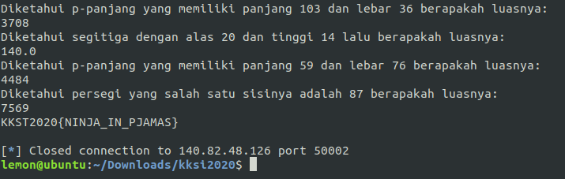
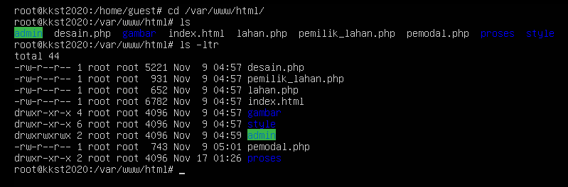
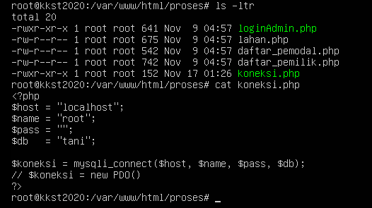
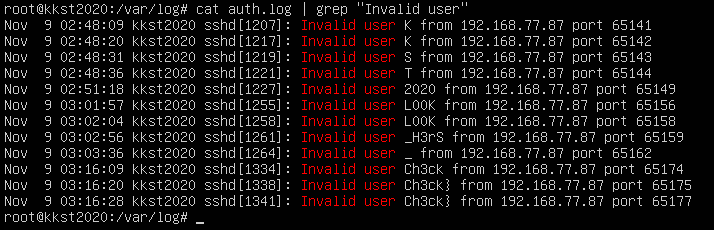
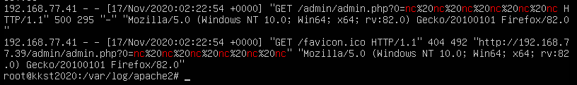
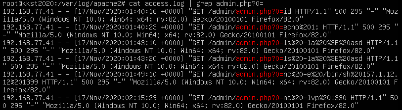
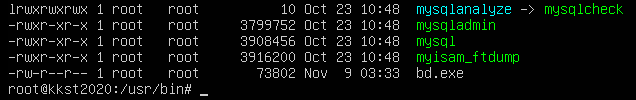
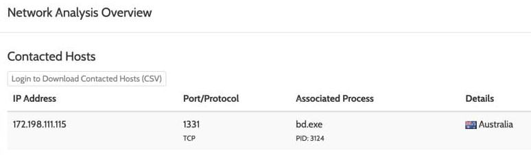

# KKST CTF 2020 - aimer

### Misc: Password VM
Diberi sebuah mesin yang dizip dan diberi string password dengan 2 char hilang yang jika di hash SHA1 akan menghasilkan ca64b496863971ad2a94ce3d492dc7d0d604d7c7. Jadi dilakukan bruteforce untuk mendapatkan 2 char yang hilang.
```php
<?php
$j = 0;
while($j==0){
    $str = "";
        $characters = array_merge(range('a','z'), range('0','9'));
        $max = count($characters) - 1;
        for ($i = 0; $i < 3; $i++) {
            $rand = mt_rand(0, $max);
            $str .= $characters[$rand];
        $acak = str_split($str);
        }
    echo $str."\xA";
    $string = "6879d9f430".$acak[0]."554b113282dfc84d7335".$acak[1]."";
    $hashnew = sha1 ($string);
    echo $string."\xA";
    echo $hashnew."\xA";

    if ($hashnew == "ca64b496863971ad2a94ce3d492dc7d0d604d7c7") {
        echo "\n res : ".$string."\xA";
        $j = 1;
    }
}
?>
```
Jalankan


**Flag: KKST2020{6879d9f4300554b113292dfc94d7335a}**

### Misc: Siapa juga gak bisa matematika?
Diberi sebuah service yang akan memunculkan pertanyaan mengenai luas dan keliling dari trapesium, segitiga, persegi, dan persegi panjang yang semua harus dijawab untuk mendapatkan flag. Kami menggunakan script python untuk melakukan automisasi.
```python
from pwn import *

r = remote("140.82.48.126", 50002)
soal

while "{" not in soal:
	resp = r.recv( 1024)
	soal = resp.lstrip().decode("utf-8")
	print(soal)
	if "trapesium" in soal:
		soal = soal.split()
		a = int( soal[6])
		b = int(soal[11])
		t = int( soal[14])

		luas (((a+b)/int(2)) * t)
		print(luas)
		hasil = str(int(luas))
	elif "segitiga" in soal:
		soal = soal.split()
		luas = (int(soal[4]) * int(soal[7]) / int(2))
		print(luas)
		hasil = str(int(luas))
	elif "p-panjang" in soal:
		if "luasnya" in soal:
			soal = soal.split()
			p int(soal[5])
			i int(soal[8])

			luas = p*l
			print(luas)
			hasil = str(luas)
	elif "kelilingnya" in soal:
		soal = soal.split()
		p = int(soal[5])
		l = int(soal[8])
		luas = (p*2)+( 1*2)
		print(luas)
		hasil = str(luas)
	elif "persegi" in soal:
		persegi = soal
		if "luasnya" in persegi:
			sisi = persegi.split()
			sisi = int(sisi[7])
			luas = sisi**2
			print(luas)
			hasil = str(luas)
	elif "kelilingnya" in persegi:
		sisi = persegi.split()
		luas = int(sisi[7]) * 4
		print(luas)
		hasil = str(luas)
	r.sendline(hasil)
```

Jalankan



**Flag: KKST2020{NINJA_IN_PJAMAS}**

### Forensic: Dia Jahil!
Setelah mengekstrak mesin yang diberikan tadi, pada challenge ini diminta untuk mencari file yang diubah pada website, jadi kami mencari di direktori /var/www/html/



Terlihat perbedaan pada direktori proses



Di dalam direktori proses terdapat perbedaan tanggal pada file koneksi.php
**Flag: KKST2020{koneksi.php}**

### Forensic: Siapa yang melakukan?
Dari deskripsi challenge, attacker melakukan serangan pada SSH, kami lalu mengecek auth.log yang ada pada direktori /var/log/. Kami mendapatkan potongan flag pada Invalid user.



Disusun dan didapatkan flag.
**Flag: KKST2020{L00K_H3rS_Ch3ck}**

### Forensic: Ke mana dia kembali?
Di challenge ini attacker melakukan backconnect dan disuruh untuk mencari IP dan port yang digunakan. Kami lalu mengecek semua log pada /var/log/ dan mencari dengan filter **nc**. Hasilnya di file access.log ditemukan bahwa attacker melakukan backconnect melalui admin.php.



Jadi kami mempersempit pencarian dengan filter **admin.php?0=** dan ditemukan IP dan port yang digunakan.



**Flag: {157.1.12.12:1399}**

### Forensic: Keberuntungan
Di challenge ini attacker menyembunyikan file berekstensi .exe di dalam mesin. Kami mencari dan ditemukan file bd.exe pada direktori /usr/bin/



Kami mengambil file tersebut dan melakukan analisis menggunakan [Hybrid Analysis](https://www.hybrid-analysis.com/), hasilnya didapatkan informasi sebagai berikut.



**Flag: {/usr/bin/bd.exe:172.198.111.115:1331}**