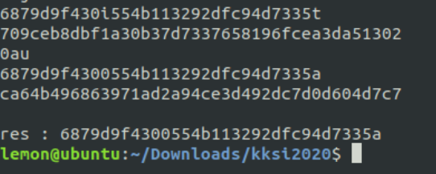

# KKST CTF 2020 - aimer

### Misc: Password VM
Diberi sebuah mesin yang dizip dan diberi string password dengan 2 char hilang yang jika di hash SHA1 akan menghasilkan ca64b496863971ad2a94ce3d492dc7d0d604d7c7. Jadi dilakukan bruteforce untuk mendapatkan 2 char yang hilang.
```php
<?php
$j = 0;
while($j==0){
    $str = "";
        $characters = array_merge(range('a','z'), range('0','9'));
        $max = count($characters) - 1;
        for ($i = 0; $i < 3; $i++) {
            $rand = mt_rand(0, $max);
            $str .= $characters[$rand];
        $acak = str_split($str);
        }
    echo $str."\xA";
    $string = "6879d9f430".$acak[0]."554b113282dfc84d7335".$acak[1]."";
    $hashnew = sha1 ($string);
    echo $string."\xA";
    echo $hashnew."\xA";

    if ($hashnew == "ca64b496863971ad2a94ce3d492dc7d0d604d7c7") {
        echo "\n res : ".$string."\xA";
        $j = 1;
    }
}
?>
Jalankan

```
**Flag: KKST2020{6879d9f4300554b113292dfc94d7335a}**