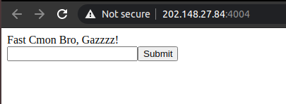
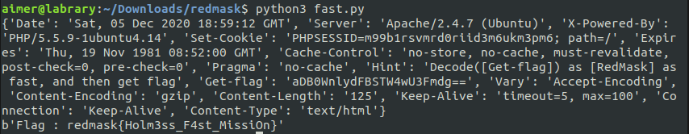
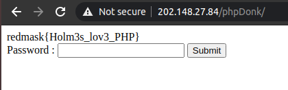
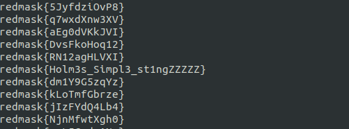

# RedMask CTF 2020 - aimyon

### Web: F4st
Diberikan link website dengan tampilan seperti berikut.



Dari deskripsi challenge ini kita harus melakukan POST pada parameter RedMask. Setelah dilakukan ternyata kita perlu melakukan decode response Get-flag yang berisi string base64 dan POST dengan parameter RedMask. Dibuat solver menggunakan python.
```python
import requests
import base64

url = "http://202.148.27.84:4004/index.php"
s = requests.Session()
r = s.get(url)
while True:
    print(r.headers)
    isi = r.headers["Get-flag"]
    res = base64.b64decode(isi)
    has = s.post("http://202.148.27.84:4004/index.php", data={'RedMask': res, 'type': 'text'})
    print(has.content)
    break
```

Jalankan



**Flag: redmask{Holm3ss_F4st_MissiOn}**

### Web: phpDonk
Diberi challenge deskripsi **Do You Love PHP Language ?** dan link website. Ketika dibuka tampilan website tersebut hanya sebuah form password. Challenge ini merupakan sebuah md5 comparison yang bisa di exploit dengan PHP type juggling ($md5 akan di compare dengan md5($md5)). Kami mencari referensi dan didapatkan string yaitu 0e215962017, saat disubmit didapatkan flag.



**Flag: redmask{Holm3s_lov3_PHP}**

### Reverse: holm3s
Diberikan sebuah binary holm3s, dengan menggunakan command strings didapatkan flag.



**redmask{Holm3s_Simpl3_st1ngZZZZZ}**