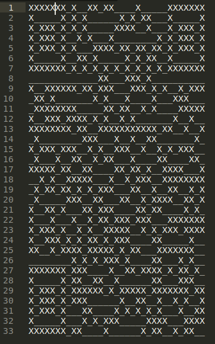
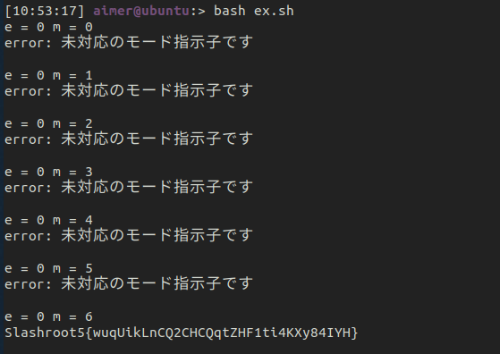
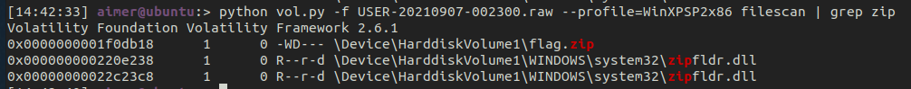
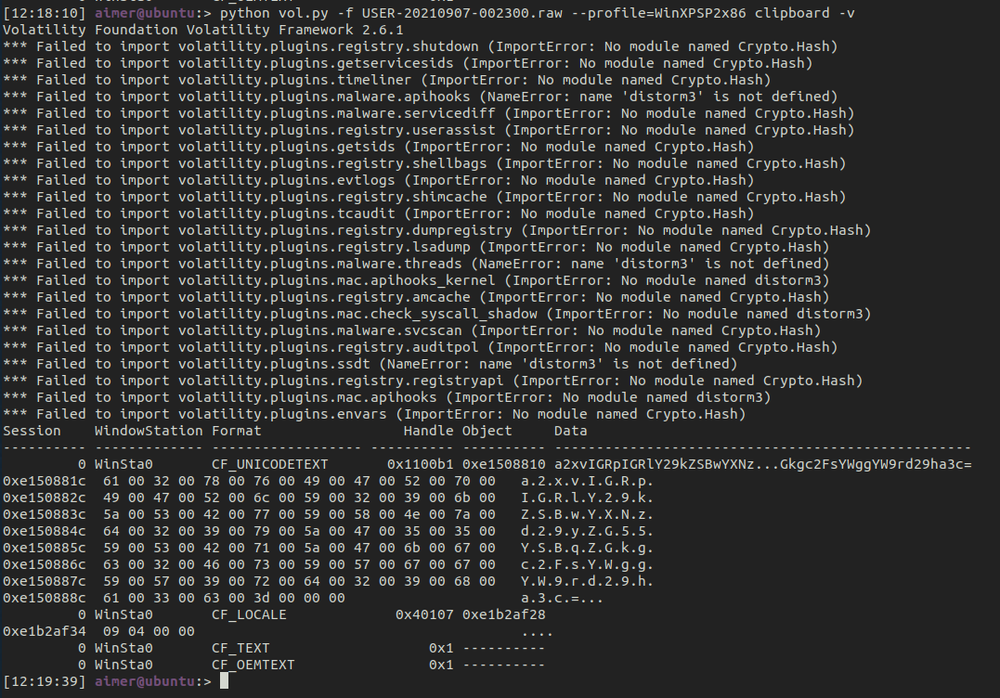
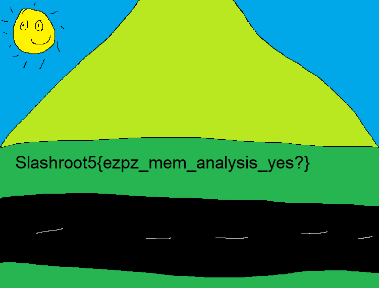

  
# Slashroot5.0 CTF - Kyaaaa....Skadi :3

### Forensic: FiX QeRen
Diberi file txt berisi simbol yang membentuk QR, kami coba menggunakan [strong-qr-decoder](https://github.com/waidotto/strong-qr-decoder) namun gagal karena QR tidak sesuai. Jika dilihat lagi terdapat _ (underscore) disekitar QR dan juga baris dan kolom yang berulang sehingga dihapus hasilnya



Kemudian buat script bash untuk meloop error correction dan mask dari [strong-qr-decoder](https://github.com/waidotto/strong-qr-decoder)
```bash
for e in 0 1 2 3  
do  
	for m in 0 1 2 3 4 5 6 7  
	do  
		echo e = $e m = $m  
		python sqrd.py qr.txt -e $e -m $m  
		echo  
	done  
done
```
Hasilnya flag didapatkan pada e = 0 dan m = 6



**Flag: Slashroot5{wuqUikLnCQ2CHCQqtZHF1ti4KXy84IYH}**

### Forensic: Elp me pls
Diberi file raw memory dengan profile **WinXPSP2x86**. Pertama lihat pslist terdapat 3 program yang cukup menarik yaitu explorer, notepad, dan mspaint. Karena ada explorer jadi kami coba cek filescan dengan filter zip, hasilnya terdapat file flag.zip dan kami dump file tersebut. 



Ketika dibuka file tersebut meminta password, karena ada program notepad, jadi kami langsung mengecek clipboard hasilnya ditemukan string base64



**a2xvIGRpIGRlY29kZSBwYXNzd29yZG55YSBqZGkgc2FsYWggYW9rd29ha3c=** decode menjadi **klo di decode passwordnya jdi salah aokwoakw**, jadi kami berasumsi passwordnya dalam bentuk base64. Saat diekstrak didapatkan flag.



**Flag: Slashroot5{ezpz_mem_analysis_yes?}**