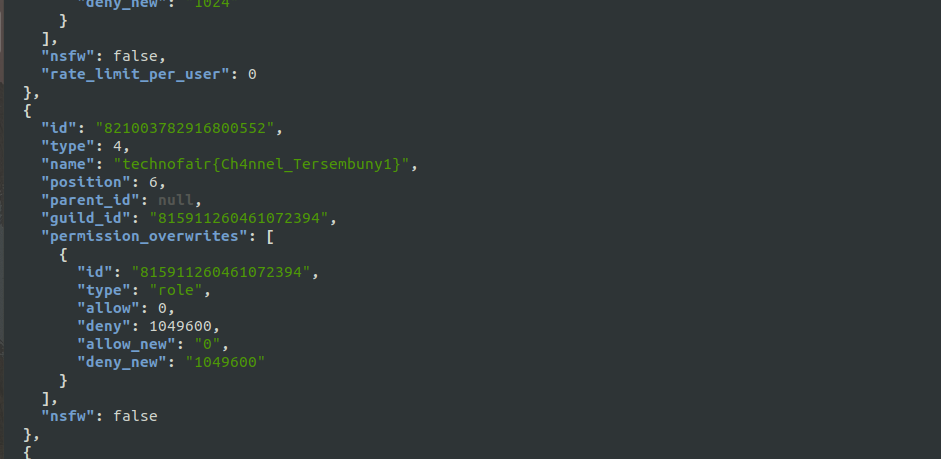
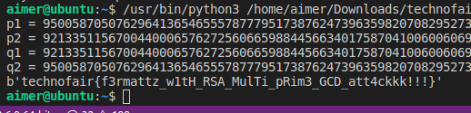

# Technofair 8.0 CTF - Ramagendhis

### Misc: Channel Rahasia
Challenge ini disuruh mencari channel tersembunyi di discord technofair. Petama cari token akun discord dengan Inspect > Application. Kemudian pakai command **curl -sH "Authorization: TOKEN" https://discordapp.com/api/v6/guilds/815911260461072394/channels |
jq**, scroll sampai bawah dan dapet channelnya



### Cryptography: A Lucky Loop
Challenge base64 yang posisinya digabung, tinggal benerin dan decode secara rekursif.

**Flag: technofair{congratulations_i_am_the_flag!}**

### Cryptography Aku dan 4 bilangan prima
DIberi file chall.py dan out.txt yang merupakan challenge multi-prime RSA. Lakukan Fermat Attack untuk memfaktorkan N, setelah dapat 2 pasang lalu hanya perlu ambil gcd untuk mencari p, q, p + δ 1 , dan q + δ 2.
**Solver**
```python
import itertools
import math
import gmpy2

c = 5333020300559057627358629150444779517927607675346073210522985591749203153560945527905471617055390862832090724275674301850841328746015818539999254106959583022492771703624475944141387595460858005483478153896882057074736219148307775833908988111821196571444363406298895482129627722808797729608415039516568435053064741173178431954979628184113077609472474158501321140759120865933591449468716625271915315192237652960416609140093720936411488882176262245872088399590046010317722025560167003681009206835834580085250672176381127010208394234527481235534697123574687573506314887709574961111534684456158044614521548036760981001130
a1 = 87532244693480177565752612147110666050649456875132890686651985770788743322757826991139316382684264280528669791004982844494482648770499411453235243565104795368674685432286182183487143604135243632177176789577970172614562167853192272947448715602752197007595173235622869332301735765163369792987710038704405926257
a2 = 87532244693480177565752612147110666050649456875132890686651985770788743322757826991139316382684264280528669791004982844494482648770499411453235243565110229566046867716080977417017159922269139072366920159217505058184326862452214692363854004077390588381724064434195722761610328105768725231474610760701656559341
b1 = 87532244693480177565752612147110666050649456875132890686651985770788743322757826991139316382684264280528669791004982844494482648770499411453235243565104130327581132024796623924581999037918109900402658044619903259585203778376404462499300957949101713806710122894582981723302819186754813679520425070069971175487
b2 = 87532244693480177565752612147110666050649456875132890686651985770788743322757826991139316382684264280528669791004982844494482648770499411453235243565110894607140421123570535675922304488486272804141438904175571971213685251929002502812001761731041071582609114775235610370609244684177281344941895729336091356451
assert a1 * a2 == b1 * b2
e = 65537
p1 = math.gcd(a1, b1)
q1 = math.gcd(a2, b1)
p2 = math.gcd(a1, b2)
q2 = math.gcd(a2, b2)
print("p1 = {}".format(p1))
print("p2 = {}".format(p2))
print("q1 = {}".format(q1))
print("q2 = {}".format(q2))

n = p1 * p2 * q1 * q2
phi= (p1 - 1) * (p2 - 1) * (q1 - 1) * (q2 - 1)
d = gmpy2.invert(e, phi)
m = pow(c, d, n)
print(bytes.fromhex(hex(m)[2:]))
```
Jalankan



**Flag: technofair{f3rmattz_w1tH_RSA_MulTi_pRim3_GCD_att4ckkk!!!}**

### Forensic: doomp
Diberi file raw yang merupakan file memory. Didapat profile yaitu **WinXPSP2x86**, cari proses apa yang digunakan, coba Dumpit.exe lalu grep technofait.


**Flag: technofair{mindyourbusiness2395}**